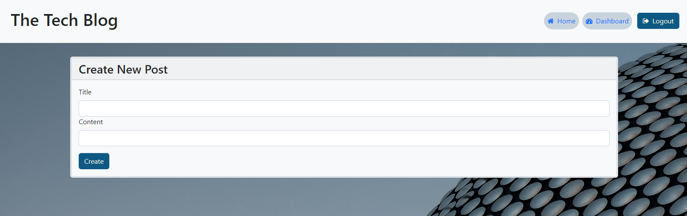

# The Tech Blog

### By Mackenzie Gray

## Technologies Used 

- Node.js/Express.js to create a RESTful API
- MySQL database with Sequelize ORM for the database
- Handlebars.js as the template engine
- Javascript, CSS and Bootstrap framework for the styling and interaction between elements of the front-end 
- npm packages such as bcrypt, connect-session-sequelize, dotenv and express-session
- Heroku for application hosting

## Description 

The motivation for this project was to create a CMS-style blog site for a developer that writes about technology. They can publish articles, posts, thoughts and opinions which can be viewed and commented on by other developers and application users. 

A full stack application combining a back-end of a server, database, API and user authentication was written to connect to an intuitive front-end.

## Usage and Installation

Installation of npm packages required are invoked with the following command:

`npm i`

Data is seeded by invoking the following command:

`node seeds/seed.js`

The application server will be invoked with the following command:

`node server.js`

## Link to deployed Heroku Application

## Screenshots

